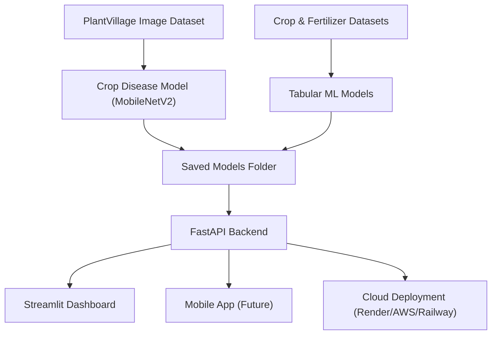

<<<<<<< HEAD


# **🌾 CropAI – AI-powered Agricultural Assistant**

*A Deep Learning + Machine Learning-based system for crop disease detection, crop recommendation, and fertilizer recommendation.*


---

# 🚀 **Project Overview**

CropAI is a fully integrated, end-to-end AI system for farmers that can:

1. **Detect crop disease** from an image
2. **Recommend the best crop** based on soil & climate parameters
3. **Recommend the right fertilizer** based on crop, soil type, nutrients

Includes:

* **ML + DL Models**
* **FastAPI Backend**
* **Streamlit Dashboard**
* **Cloud Deployment**
* *(Mobile app coming soon)*

---

## 🏷️ Tech Stack Badges

<div align="center">
  


</div>

---

# 🔥 **Features**

## 🩻 1. Crop Disease Detection (Computer Vision)

* Trained MobileNetV2 on the **PlantVillage dataset**
* Input: leaf image
* Output: disease label + confidence

**API Endpoint:** `POST /predict-disease`
**Example Response:**

```json
{
  "predicted_class_index": 14,
  "disease_label": "Tomato___Early_blight",
  "confidence": 0.83
}
```

---

## 🌱 2. Crop Recommendation System

Uses soil & climate parameters:

* N, P, K
* Temperature
* Humidity
* pH
* Rainfall

**API Endpoint:** `POST /recommend-crop`
**Example Response:**

```json
{
  "recommended_crop": "rice"
}
```

---

## 🌾 3. Fertilizer Recommendation System

Based on:

* Temperature, Humidity, Moisture
* Soil Type, Crop Type
* N, P, K

**API Endpoint:** `POST /recommend-fertilizer`
**Example Response:**

```json
{
  "recommended_fertilizer": "Urea"
}
```

---

# 🧱 **Project Architecture**



---

# 🌍 **Live API (Render Deployment)**

The backend is publicly deployed via **Render**.

* **Base URL:** `https://cropai-project.onrender.com/`
* **Swagger Docs:** `https://cropai-project.onrender.com/docs`

> ⚠️ *Note: Render free tier sleeps when idle. First request may take 20–40 seconds.*

---

# 📡 **API Reference (Quick)**

## **GET /health**

Check server status.

Response:

```json
{ "status": "ok" }
```

---

## **POST /predict-disease**

Predict disease from uploaded image.

**Body:** multipart form-data → `file`

**Response example:**

```json
{
  "predicted_class_index": 14,
  "disease_label": "Tomato___Early_blight",
  "confidence": 0.83
}
```

---

## **POST /recommend-crop**

**Body:**

```json
{
  "N": 90,
  "P": 42,
  "K": 43,
  "temperature": 22.0,
  "humidity": 80.0,
  "ph": 6.5,
  "rainfall": 200.0
}
```

**Response:**

```json
{ "recommended_crop": "rice" }
```

---

## **POST /recommend-fertilizer**

**Body:**

```json
{
  "Temparature": 26.0,
  "Humidity": 52.0,
  "Moisture": 38.0,
  "Soil_Type": "Loamy",
  "Crop_Type": "Sugarcane",
  "Nitrogen": 50.0,
  "Potassium": 40.0,
  "Phosphorous": 40.0
}
```

**Response:**

```json
{ "recommended_fertilizer": "Urea" }
```

---

# 🖼️ **Screenshots**

All screenshots are stored in the `/screenshots` folder on GitHub.

### **Dashboard Homepage**


### **Disease Prediction**


### **Crop Recommendation**


### **Fertilizer Recommendation**


---

# 🧠 **How to Run Locally**

### 1️⃣ Create environment

```bash
conda create -n cropai python=3.10
conda activate cropai
pip install -r requirements.txt
```

### 2️⃣ Start the backend

```bash
cd backend
uvicorn main:app --reload --host 0.0.0.0 --port 8000
```

### 3️⃣ Run Streamlit dashboard

```bash
cd dashboard
streamlit run app.py
```

---

# 🎯 **Future Improvements**

* Better disease classification accuracy
* More crops & fertilizers
* Full mobile app (Flutter)
* Multi-language farmer UI
* Deployment across scalable cloud infra
* Improve accuracy with heavy fine-tuning
* Deploy backend + dashboard to Render/Railway/AWS
* Add real-time weather API integration
* Build farmer login + recommendation history

---

# 📄 **License**

This project is licensed under the **MIT License**.
Feel free to use it, modify it, and build upon it with proper attribution.

---

# 💼 **Why This Project Matters**

This project demonstrates:

* 🧠 Deep Learning (CV with MobileNetV2)
* 📊 Machine Learning (RandomForest, preprocessing)
* ⚙️ API engineering (FastAPI, Pydantic, CORS)
* 🖥️ Interactive dashboards (Streamlit)
* 🧩 Full end-to-end design (data → model → API → UI)
* 🧱 Production-ready architecture

Perfect for:

* Resume
* LinkedIn posts
* Interviews
* Final-year projects
* ML engineering portfolios

---

# 👤 **Author**

**Akhil Saurabh**


=======
# CropAI-Project
>>>>>>> fd2374120db9ec86349f304bcd7844a5ea3b2f07
